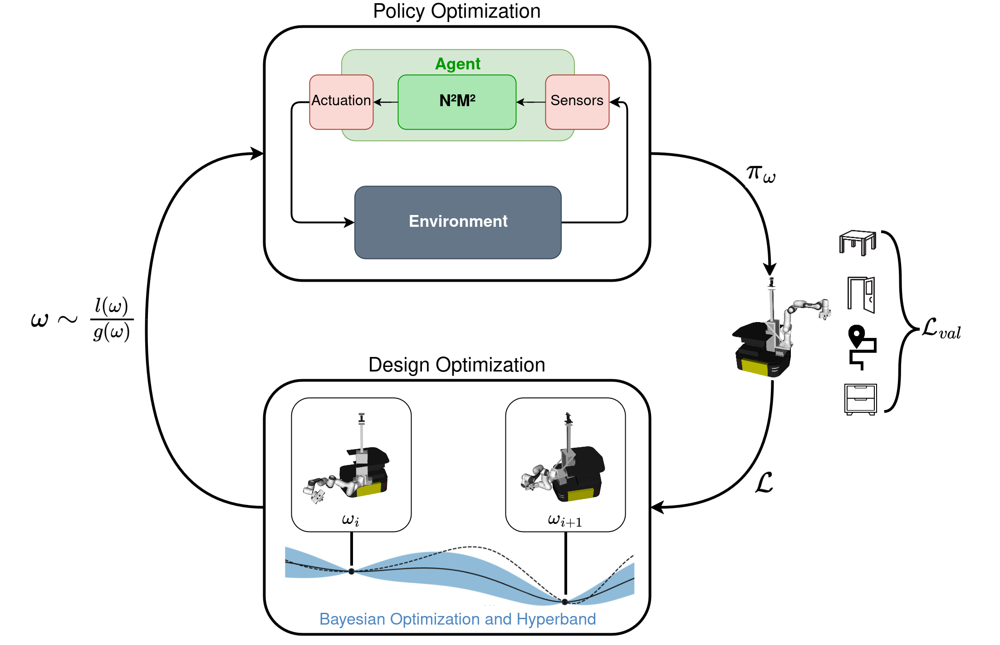

# MoMa-Codesign
[**arXiv**](https://arxiv.org/abs/todo) | [**website**](https://moma-codesign.cs.uni-freiburg.de) 

Repository providing the source code for the paper
>Task-Driven Co-Design of Mobile Manipulators
>[Raphael Schneider](https://rl.uni-freiburg.de/people/)*, [Daniel Honerkamp](https://rl.uni-freiburg.de/people/honerkamp)*, [Tim Welschehold](https://rl.uni-freiburg.de/people/welschehold) and [Abhinav Valada](https://rl.uni-freiburg.de/people/valada)

  <!--  -->
  

Please cite the paper as follows:

    @article{honerkamp2024zero,
        title={Task-Driven Co-Design of Mobile Manipulators},
        journal={arXiv preprint arXiv:todo},
        author={Raphael Schneider and Daniel Honerkamp and Tim Welschehold and Abhinav Valada},
        year={2024},
    }
